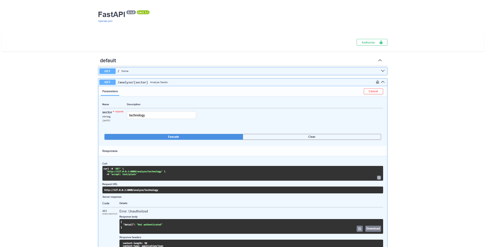
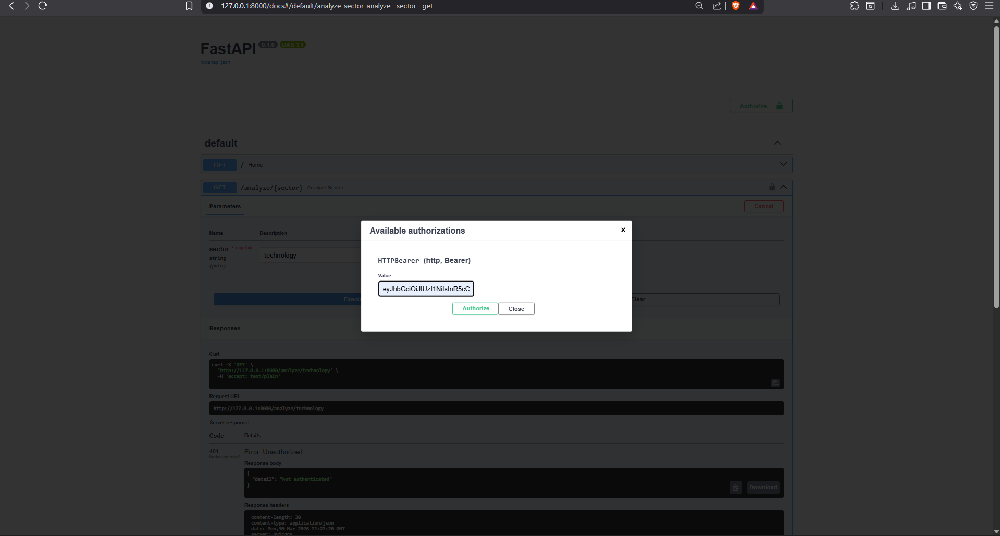
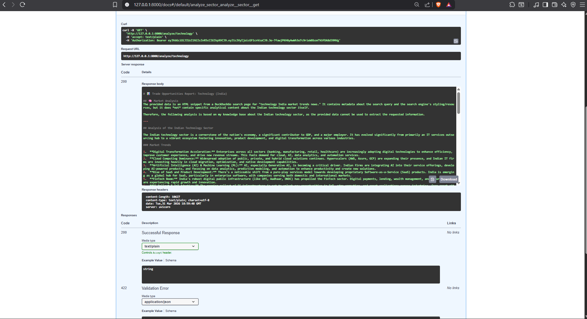
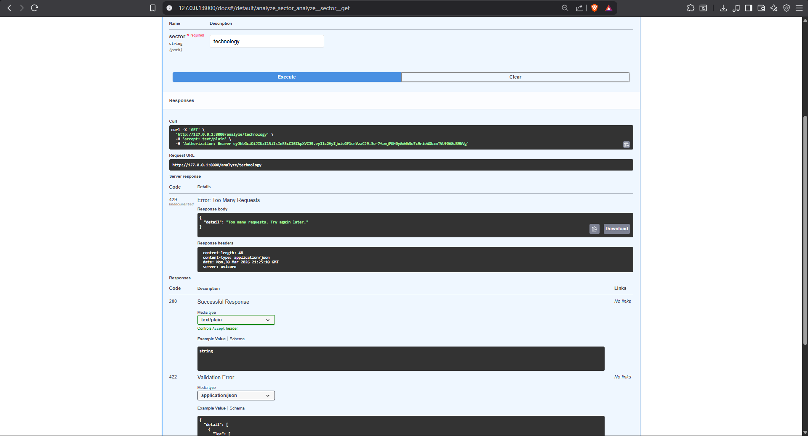

# 🚀 Trade Opportunities API

<p align="center">
  <b>Sector-Based Trade Analysis API with Authentication & Rate Limiting</b><br>
  Built using FastAPI 🚀
</p>

<p align="center">
  
  
  
  
</p>

---

## 📌 Overview

This project is a backend API that generates **trade opportunity reports** for different sectors (e.g., Technology in India).

It includes:

* 🔐 Authentication (Bearer Token)
* ⏱️ Rate Limiting
* 🧠 AI-based analysis (with fallback support)
* 📊 Structured sector insights

---

## ▶️ Getting Started

```bash
git clone https://github.com/PAURUSH077/trade-opportunities-api.git
cd trade-opportunities-api

python -m venv venv
venv\Scripts\activate

pip install -r requirements.txt
```

---

## 🔐 Environment Setup (.env)

Create a `.env` file in the root directory and add your OpenAI API key:

```env
OPENAI_API_KEY=your_api_key_here
```

⚠️ Notes:

* Do NOT commit `.env` to GitHub
* The API includes a fallback mechanism if the key is missing or quota is exceeded
* This ensures the application still works for evaluation

---

## ▶️ Run the Server

```bash
uvicorn app.main:app --reload
```

---

## 🌐 API Docs

👉 http://127.0.0.1:8000/docs

---

## 🔐 Authentication Flow

### ❌ Without Token (401 Unauthorized)



```json
{
  "detail": "Not authenticated"
}
```

---

### 🔑 Provide Bearer Token



* Click **Authorize**
* Enter token
* Access secured endpoints

---

## 📊 Endpoint

### `GET /analyze/{sector}`

Example:

```
/analyze/technology
```

---

## ✅ Successful Response (200 OK)



```
# Trade Opportunities Report: Technology (India)

## 🧠 Market Analysis
The technology sector in India is showing stable growth...

## 📌 Summary
AI-generated insights for trading opportunities...
```

---

## ⏱️ Rate Limiting (429)



```json
{
  "detail": "Too many requests. Try again later."
}
```

---

## 🧠 AI Integration

* Uses OpenAI for generating insights
* Includes fallback mechanism if quota is exceeded
* Ensures uninterrupted API response

---

## 📁 Project Structure

```
app/
 ├── main.py
 ├── routes.py
 ├── auth.py
 ├── rate_limiter.py
 ├── services/
 │    ├── ai_analyzer.py
 │    ├── data_collector.py
 │    └── report_generator.py
 └── utils/
      └── validators.py
```

---

## 📚 Learnings

* Built REST APIs using FastAPI
* Implemented authentication using Bearer tokens
* Designed rate limiting for API protection
* Integrated AI services with fallback handling
* Managed environment variables securely

---

## 🚧 Challenges Faced

### OpenAI API Quota Limitation

* Encountered `429 insufficient_quota` error
* External API dependency could break evaluation

✅ **Solution:**
Implemented fallback mechanism to ensure API always returns valid output

---

## 💡 Key Takeaways

* APIs should not depend solely on external services
* Security and reliability are critical
* Proper error handling improves system robustness

---

## 👤 Author

**Paurush Mishra**
